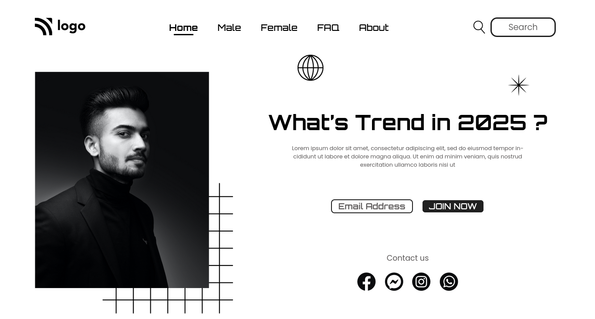

# This is street style landing page

Made by **Aditya Kadali**

## Screenshots:

## Built with:

- Semantic HTML
- CSS

## Key learnings:

- Absolute positioning of elements.
- Using of z-index
- Styling of buttons effectively

## Time taken:

- This project took me more than 5hrs of time. At first I cannot get to position things as I wanted with some research it become easy.

## Links: 
- [Live Demo](https://streetstyle-landing.netlify.app/)
- [Source Code](https://github.com/Adityakadali/Streetstyle-landing-page)
